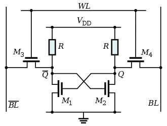
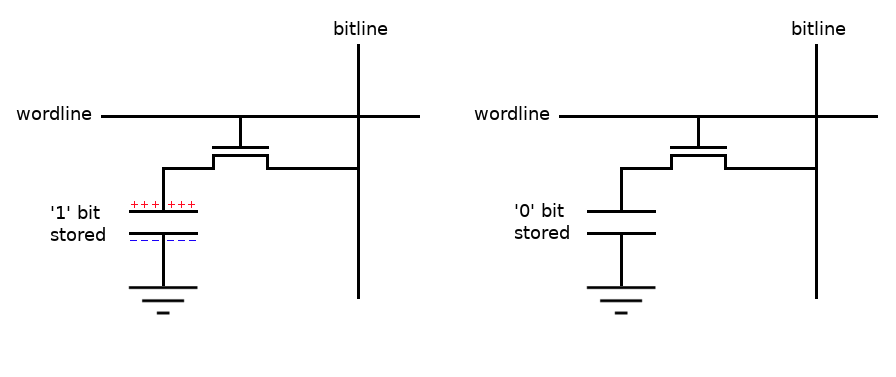
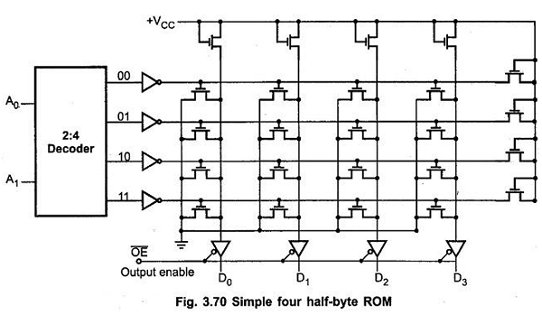
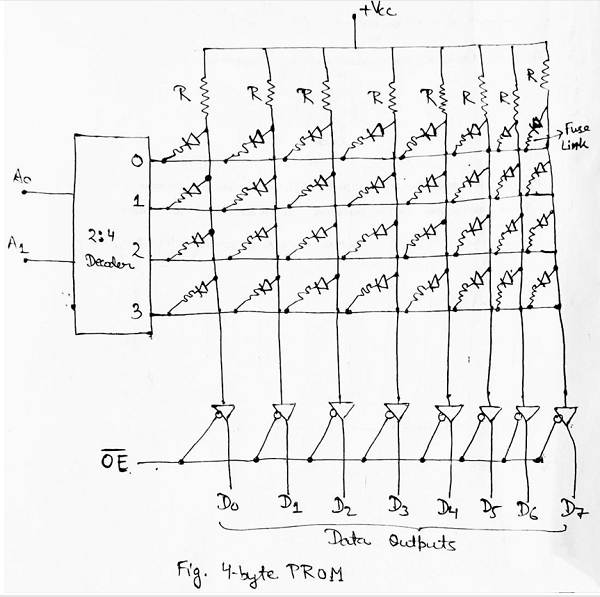
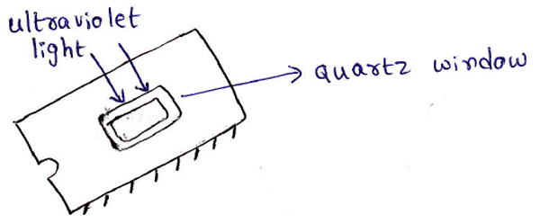

# Type of Memory - Phân loại bộ nhớ

### RAM - Random Access Memory

Có nhiều cách giải thích tên gọi Random Access Memory:

- RAM có tên theo một lý do lịch sử mà đến nay không còn nhiều ý nghĩa nữa: ở RAM, mọi dữ liệu được truy cập với độ trễ giống nhau như bất kỳ dữ liệu khác, trái ngược lại là Sequential Access Memory - Truy cập dữ liệu tuần tự: dữ liệu ở một đầu sẽ được truy cập nhanh hơn ở đầu còn lại.
- Lý giải theo mục đích: `Random` ở đây không phải là sự ngẫu nhiên, mà là bất kỳ - `Arbitrary`: bất kỳ lúc nào cũng có thể truy cập đến một ô nhớ ngay lập tức mà không cần phải quét qua các ô nhớ trước đó.

Đặc điểm chung duy nhất giữa DRAM và SRAM dữ liệu được lưu trong cả hai loại đều sẽ mất khi mất nguồn cấp.

Khác nhau giữa DRAM và SRAM là ở tốc độ ghi đọc, thời gian dữ liệu được lưu, dung lượng, giá thành.

##### SRAM - Static RAM

SRAM được sáng chế bởi Robert Norman vào năm 1963 tại Fairchild Semiconductor. Một SRAM cell thường có 6 transistor. Mỗi bit của cell được lưu trong 4 transistor (M1, M2, M3, M4), M5 và M6 dùng để kiểm soát quyền truy cập vào cell lưu trữ trong suốt các hoạt động read và write. Ngoài ra còn có các loại SRAM khác nhau về số lượng transistor cấu tạo SRAM cell: 4T, 5T, 7T, 8T, 9T, 10T SRAM.

4T SRAM sử dụng 4 transistor giúp mật độ cao hơn nhưng độ phức tạp trong khâu sản xuất lại tăng lên rất nhiều. Các điện trở phải có kích thước nhỏ và giá trị lớn.

- Tốc độ ghi đọc (Access time) nhanh hơn gấp 4 lần so với DRAM.
- Thời gian lưu được dữ liệu dài hạn, cho tới khi mất nguồn cấp.
- Dung lượng nhỏ hơn DRAM.
- Giá thành đắt hơn DRAM.

SRAM được dùng trong các ứng dụng cần tốc độ cực cao. Nếu hệ thống chỉ cần dung lượng nhỏ thì có thể dùng luôn SRAM.

Ứng dụng của SRAM:
- Dùng trong hệ thống nhúng, còn được gọi là ESRAM.
- Dùng trong lĩnh vực computer: CPU register files, internal CPU cache, internal GPU cache, external burst mode SRAM caches, hard disk buffers, router buffers,...
- Integrated on chip: microcontroller, cache CPU, FPGA, CPLD, ASICs.

##### DRAM - Dynamic RAM

DRAM được sáng chế bởi Robert Dennard vào năm 1966 tại IBM, một ô lưu trữ cơ bản của DRAM bao gồm 2 phần tử: transistor và capacitor.
Khi một bit cần được lưu vào bộ nhớ, transistor được dùng để nạp (bit 1) hoặc xả (bit 0) cho tụ điện. Trong suốt quá trình read hoặc write, wordline ở mức cao và transistor sẽ kết nối tụ điện với bitline. Khi đọc từ bitline sẽ khiến điện tích xả ra khỏi capacitor, giải quyết vấn đề này bằng cách thực hiện nạp trước - đưa giá trị đọc được từ bitline vào lại capacitor.

Vấn đề là capacitor sẽ bị rò rỉ điện tích theo thời gian. Vì vậy để duy trì dữ liệu trong DRAM, các tụ điện phải được refresh định kỳ để cho dữ liệu không bao giờ bị mất do rò rỉ.

- Tốc độ ghi đọc (Accsess time) chậm hơn SRAM.
- Thời gian lưu được dữ liệu rất ngắn, được refesh theo chu kỳ dưới 1s.
- Dung lượng lớn hơn SRAM.
- Giá rẻ hơn SRAM.

DRAM Controller: 
- Đây là phần cứng được thêm vào giữa Vi xử lý và DRAM.
-  Mục đích chính là thực hiện refresh cần thiết để giữ dữ liệu vẫn còn trong DRAM. 
-  Phải có quá trình khởi tạo DRAM Controller, gồm thông số chu kỳ refresh.
-  Nếu không có RAM nào trong hệ thống, phải khởi tạo DRAM trước khi khởi tạo stack, heap vì các segment này sẽ được lưu trong DRAM.

Có nhiều hệ thống gồm cả 2 loại SRAM và DRAM:
- Một khối SRAM nhỏ (vài trăm KB) dọc theo datapath quan trọng.
- Một khối DRAM lớn (MB) cho mọi thứ khác.

Một số hệ thống nhúng nhỏ hoạt động mà không cần thêm bất kỳ bộ nhớ nào: chỉ sử dụng bộ nhớ trên chip của VĐK.

Ứng dụng của DRAM:
- SDR SDRAM - Single Data Rate Synchronous DRAM: Thế hệ SDRAM đầu tiên thực hiện một lần truyền dữ liệu trong một clock.
- DDR SDRAM - Double data rate Synchronous DRAM: sự phát triển sau này của SDRAM, được sử dụng trong bộ nhớ PC và các phiên bản được đánh số như DDR2, DDR3, DDR4,... 
- Graphic RAM: là Asynchronous DRAM và Synchronous DRAM được thiết kế để xử lý các tác vụ liên quan đến đồ họa, gồm có: VRAM (Video DRAM), WRAM (Windown DRAM), MDRAM (Multibank DRAM), SGRAM(Synchronous graphics RAM), GDDR SDRAM (Graphics double data rate SDRAM), PSRAM & PSDRAM (Pseudostatic RAM).

### ROM - Read Only Memory

Tên Read Only Memory là do ban đầu ROM chỉ được thiết kế với mục đích đọc dữ liệu mà không được ghi vào. Nhưng hiện nay ROM được phát triển với nhiều loại có thể thực hiện ghi và đọc được.

Tất cả các loại ROM có chung đặc điểm: tính giữ dữ liệu khi nguồn cấp bị ngắt.

Phân loại ROM dựa trên : cách ghi dữ liệu và số lần ghi dữ liệu.

##### Masked ROM - Hard-wired ROM

Mask ROM có các đặc điểm sau:

- Nội dung của Masked ROM được chỉ định trước khi sản xuất chip nhớ.
- Dùng để lưu một bộ dữ liệu lập trình hoặc instruction lập trình.
- Chỉ có 1 lần ghi dữ liệu duy nhất và ở ngay bước sản xuất.
- Giá thành sản xuất thấp chỉ khi sản xuất hàng loạt bản sao dữ liệu được lưu trong Masked ROM.

##### PROM - Programmable ROM
- ROM ở trạng thái chưa được lập trình: toàn bộ các bit lưu trong PROM đều là bit 1.
- Chỉ được ghi vào PROM 1 lần duy nhất, sau quá trình ghi thì dữ liệu được lưu sẽ không bao giờ bị thay đổi.
- PROM Còn được gọi là OTP - One Time Programmable.
- Quá trình ghi cần có device programmer, ghi bằng cách đưa điện áp cao hơn bình thường vào các chân đầu vào đặt biệt của chip.

##### EPROM - Erasable and Programmable ROM
- ROM ở trạng chưa được lập trình: toàn bộ bit lưu trong EPROM đều là bit 1.
- EPROM có thể xóa dữ liệu và lập trình lại nhiều lần.
- EPROM có một "cửa sổ" ở trên cùng, làm lộ ra phần silicon bán dẫn ở bên trong. Chiếu tia cực tím vào "cửa sổ" sẽ reset toàn bộ dữ liệu trong EPROM. (Quá trình này có thể mất đến 45 phút).
- Giá thành cao hơn các loại ROM khác, được sử dụng rộng rãi hiện nay.

### Hybrid Type

Đây là sự kết hợp giữa ROM và RAM.
Hybrid memories có thể đọc và ghi như RAM, nhưng vẫn giữ được dữ liệu khi nguồn cấp bị ngắt.

##### EEPROM - Electrically Erasable and Programmable ROM
- ROM ở trạng chưa được lập trình: toàn bộ bit lưu trong EEPROM đều là bit 1.
- EEPROM có thể xóa dữ liệu và lập trình lại nhiều lần.
- Thao tác xóa dữ liệu của EEPROM được thực hiện bằng điện.
- Mỗi một byte của EEPROM có thể bị xóa và ghi lại.
- Giá thành khá cao.
- EEPROM thường có 10000, 100000 chu kỳ ghi tối đa.
- EEPROM thường có sẵn trong các chuẩn giao tiếp song song và nối tiếp (address và data bus).

##### FLASH
- FLASH là sự kết hợp của toàn bộ ưu điểm của các thiết bị bộ nhớ cho đến nay.
- FLASH có đặc điểm: mật độ cao (dung lương cao), giá thành rẻ hơn các loại Hybrid memory khác, tốc độ đọc nhanh, ghi trung bình, thao tác lập trình lại bằng điện, nonvolatile.
- Để xóa và ghi dữ liệu và FLASH, cần một trình tự ghi dữ liệu cụ thể sử dụng các giá trị có sẵn.
- FLASH chỉ có thể xóa theo sector (8 KB ~ 64 KB)

##### NVRAM - Nonvolatile RAM

- NVRAM được xem là một SRAM có nguồn pin dự phòng.
- Khi có nguồn cấp, NV hoạt động như một SRAM thông thường. Nhưng khi ngắt nguồn thì NVRAM dùng pin để giữ lại dữ liệu mà nó đang lưu.

